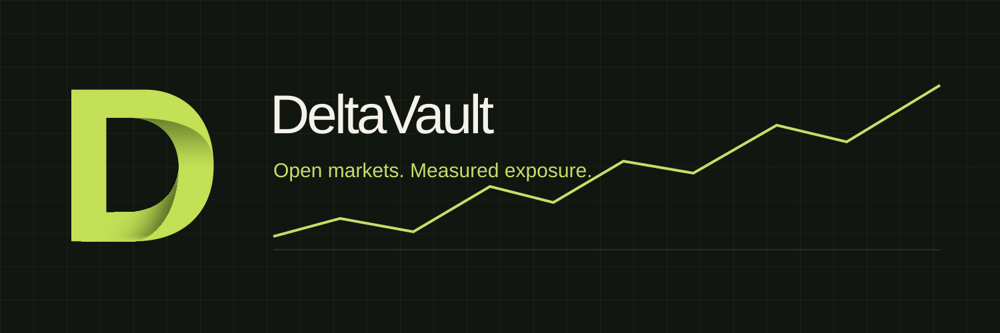

<p align="center"><a href="https://deltavault-a1.raisatunjangpacok.chatgpt.site"></a></p>

# DeltaVault

**Open markets. Measured exposure.**

[](https://github.com/deltavault-dev/deltavault/actions/workflows/types.yml)
[](https://github.com/deltavault-dev/deltavault/actions/workflows/markets.yml)
[](https://github.com/deltavault-dev/deltavault/actions/workflows/risk.yml)
[](https://github.com/deltavault-dev/deltavault/actions/workflows/wallets.yml)
[](https://github.com/deltavault-dev/deltavault/actions/workflows/api.yml)
[](https://github.com/deltavault-dev/deltavault/actions/workflows/integrity.yml)
[](https://github.com/deltavault-dev/deltavault/actions/workflows/build.yml)

A market workspace for inspecting leveraged exposure, market-specific liquidity and risk, with real CoinGecko prices and 24-hour price history.

[Open DeltaVault](https://deltavault-a1.raisatunjangpacok.chatgpt.site) · [Markets](https://deltavault-a1.raisatunjangpacok.chatgpt.site/markets) · [Whitepaper](https://deltavault-a1.raisatunjangpacok.chatgpt.site/docs) · [Get started](docs/GETTING_STARTED.md) · [Architecture](docs/ARCHITECTURE.md)

## One market, several views

| Surface | What it does |
| --- | --- |
| Markets | Compare ETH, BTC and SOL prices, 24-hour changes, volume and capitalization. |
| Trade | Inspect long or short exposure using collateral, leverage and actual market prices. |
| Vaults | Inspect each market's configured liquidity, utilization and capacity assumptions. |
| Risk Explorer | Calculate equity against a maintenance boundary under a selected price move. |
| Landing page | Replay recent prices and follow collateral, exposure, market capacity and risk through an animated explanation. |
| Whitepaper | Read the full source document directly on the website with a section index. |
| Wallets | Discover compatible browser wallets and request a public account from the selected provider. |

## Explore the code

| Area | Location |
| --- | --- |
| Routes and Whitepaper reader | `app/` |
| Market quotes and price history | `app/api/market-data/`, `app/api/market-history/` |
| CoinGecko cache, cooldown and optional API keys | `lib/coingecko-server.ts` |
| Price normalization and freshness rules | `lib/market-data.ts` |
| Position math and capacity guards | `lib/model.ts` |
| Trading and market surfaces | `components/site.tsx`, `components/market-terminal.tsx` |
| Wallet discovery and provider logos | `components/use-wallets.tsx`, `components/wallet-list.tsx` |
| Landing motion and scroll stages | `components/use-landing-motion.ts`, `components/use-mechanics-stage.ts` |
| Tests and automation | `tests/`, `.github/workflows/` |

## From price to exposure

1. Read a CoinGecko quote with its original update timestamp.
2. Choose a market, collateral, direction and leverage.
3. Calculate notional exposure, gross profit or loss, and position equity.
4. Compare equity with maintenance and exposure with configured market capacity.
5. Inspect a target move or replay real recent prices.

Calculations exclude fees, funding, slippage and execution costs. The workspace's vault liquidity and utilization are configuration assumptions, not live contract balances. See [implementation boundaries](docs/ARCHITECTURE.md#implementation-boundaries).

## Run locally

Use Node.js 22.13+ or 24, with pnpm 11.25.0.

```sh
corepack enable
corepack prepare pnpm@11.25.0 --activate
pnpm install --frozen-lockfile
pnpm dev
```

Open `http://localhost:5173`. `pnpm build` creates a Cloudflare Worker build; `pnpm start` previews it locally. The GitHub copy has no hosted project ID, so it does not target the existing publication automatically.

The public CoinGecko API can be used without a key. Optional `COINGECKO_API_KEY` or `COINGECKO_PRO_API_KEY` values belong in server environment bindings. Never use browser-exposed variables for these keys.

## Checks and GitHub Actions

```sh
pnpm typecheck
pnpm test
pnpm check:docs
pnpm check:integrity
pnpm build
```

Seven workflows run on pushes, pull requests and manual dispatch:

| Workflow | Validation |
| --- | --- |
| TypeScript | Strict type checking on Node.js 22 and 24. |
| Market data | Normalization, timestamp freshness, history and browser fallback behavior. |
| Risk calculations | Long/short outcomes, maintenance thresholds, capacity and scroll-stage boundaries. |
| Wallet list | Provider rows, brand icons, official download links and busy states. |
| API resilience | Invalid asset rejection, caching, cooldown, malformed responses and server-only Pro credentials. |
| Repository integrity | Source assets, complete Whitepaper structure, documentation links and workflow configuration. |
| Production build | Real Worker builds on Node.js 22 and 24, with build artifacts uploaded. |

CI tests use controlled upstream fixtures. They do not need secrets, sign wallet messages, send transactions or depend on CoinGecko uptime. Workflow failures propagate normally; no check is configured to ignore errors.

See [CI setup](docs/CI.md) for run verification and real status badges after the GitHub owner and repository are known.

## Project identity

DeltaVault is designed around onchain market infrastructure for Robinhood Chain. This repository contains the current website and calculation workspace. It does not contain deployed trading contracts or a transaction execution integration. Token ticker and contract address have not been supplied in this source.

Connecting a wallet requests an account only. Trade, deposit and withdrawal actions display the site's coming-soon dialog; they do not move funds.

## Contributions and security

Read [CONTRIBUTING.md](CONTRIBUTING.md), [SECURITY.md](SECURITY.md) and [third-party notices](THIRD_PARTY_NOTICES.md). A project-wide open-source license has not been selected; do not assume MIT or another license. Third-party packages retain their own licenses.
